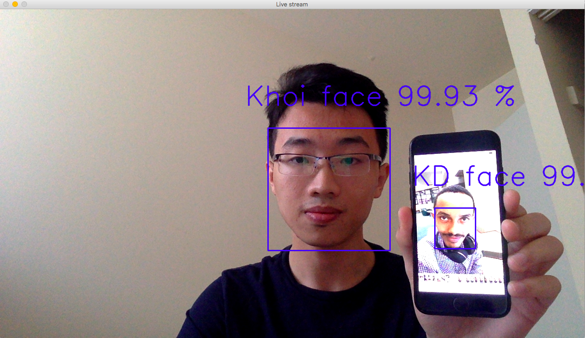

# Deep-Learning-Facial-Recognition
Utilized Tensorflow and OpenCV to train a Convolutional Neural Network that can detect faces from many sources (photos, videos, live camera) and be able to identify who they are by showing their information as long as the detected person is in the database.

# Visualization
Please click on the file "Facial Recognition.ipynb" to visualize the code and result.

